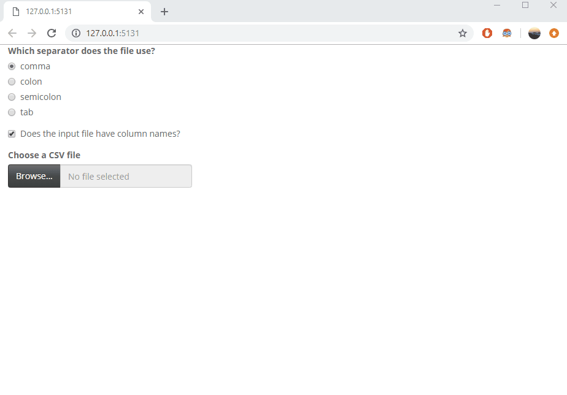
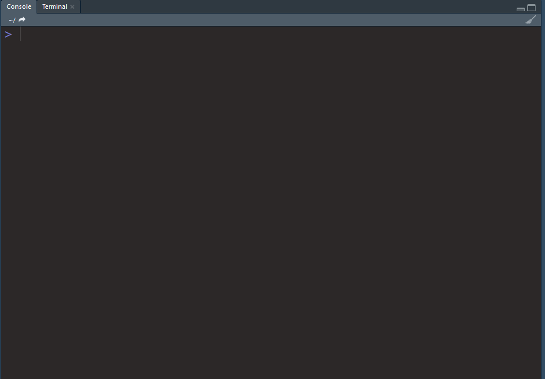

# GridCryptr
A data encryption program

The purpose of this application is to allow the sharing of sensitive data between analysts and clients.

The data recipient must establish a private key (which they must not share with anyone) and edits the application code to include a derived public key. The application is then shared with the user. Users can upload tabular data, cipher and/or remove columns, and download an encrypted file.  The encrypted file is only readable by the data recipient that provided the application.

# UI and Encryption process

# Decryption from within R
